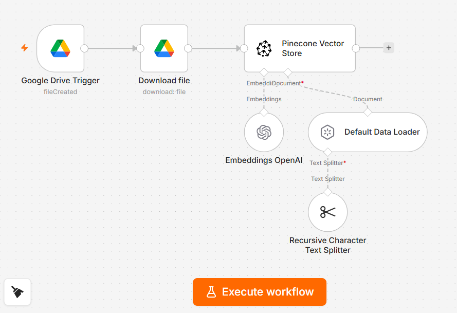
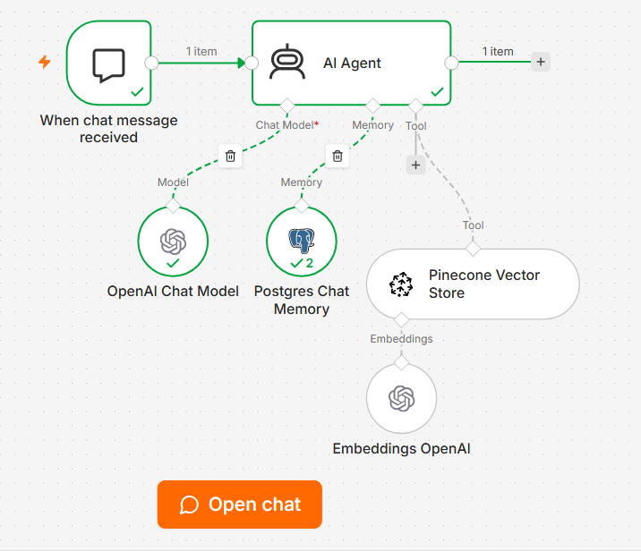
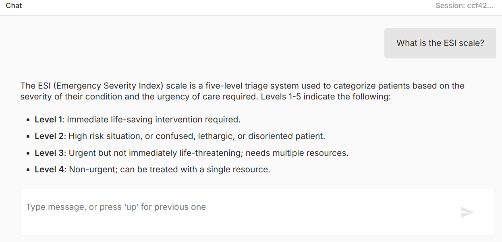
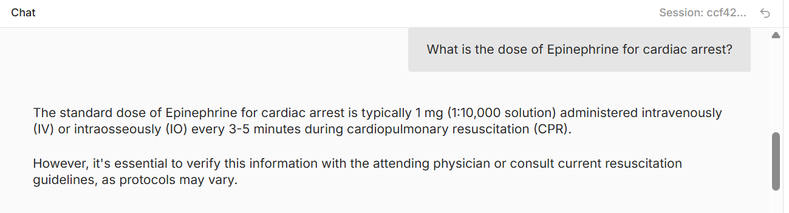

# MediCore Clinic — RAG Chatbot

An internal AI assistant for clinical and administrative staff at MediCore Clinic. Built with n8n, Pinecone, and OpenAI.

## 🔗 Live Demo

[Open Chat](https://primary-production-0e1e.up.railway.app/webhook/6b770d39-2f89-4718-8f46-e5452b483544/chat)

---

## 📌 Overview

This project implements a **Retrieval-Augmented Generation (RAG)** pipeline that allows clinic staff to query internal documentation using natural language. The system retrieves relevant context from a Pinecone vector database and generates accurate, grounded responses via GPT.

---

## 🏗️ Architecture

### Workflow 1 — Document Ingestion

```
Google Drive Trigger → Download File → Pinecone Vector Store
                                              ↑              ↑
                                    Embeddings OpenAI   Default Data Loader
                                                              ↑
                                                  Recursive Character Text Splitter
```



- Triggered automatically when a new file is uploaded to a Google Drive folder
- Documents are split into chunks using a Recursive Character Text Splitter
- Each chunk is embedded with `text-embedding-ada-002` (1536 dimensions)
- Vectors are stored in Pinecone under the `medicore` namespace

### Workflow 2 — Chatbot

```
When Chat Message Received → AI Agent
                                 ↑           ↑          ↑
                         OpenAI Chat Model  Postgres  Pinecone Vector Store
                                            Memory         ↑
                                                    Embeddings OpenAI
```



- Hosted chat interface publicly accessible via URL
- AI Agent retrieves relevant chunks from Pinecone on each query
- Conversation memory persisted in PostgreSQL via `Postgres Chat Memory`
- Responds in the same language the user writes in

---

## 📸 Screenshots




---

## 🧠 Knowledge Base

The vector database contains 4 internal documents (64 chunks total):

| File | Description |
|---|---|
| `01_clinical_protocols.md` | Admission, discharge, Code Blue, infection control, surgical checklist |
| `02_medication_guide.md` | Emergency meds, analgesics, antibiotics, cardiovascular, high-alert medications |
| `03_staff_policies.md` | Conduct, scheduling, HIPAA, incident reporting, leave & benefits, emergency codes |
| `04_administrative_procedures.md` | Patient registration, insurance, scheduling, billing, medical records, referrals |

---

## 🛠️ Tech Stack

| Tool | Role |
|---|---|
| [n8n](https://n8n.io) | Workflow automation |
| [Pinecone](https://pinecone.io) | Vector database |
| [OpenAI](https://openai.com) | Embeddings (`ada-002`) + Chat (`gpt-4o`) |
| [PostgreSQL](https://postgresql.org) | Conversation memory |
| [Google Drive](https://drive.google.com) | Document source |
| Railway | n8n hosting |

---

## ⚙️ Setup

### Prerequisites

- n8n instance (self-hosted or Railway)
- Pinecone account
- OpenAI API key
- PostgreSQL database
- Google Drive credentials

### Pinecone Index Configuration

- **Index name:** `medicore`
- **Dimensions:** `1536`
- **Metric:** `cosine`
- **Namespace:** `medicore`

### Steps

1. Clone this repository
2. Import both n8n workflows from the `/workflows` folder
3. Configure credentials in n8n:
   - OpenAI API key
   - Pinecone API key
   - Google Drive OAuth2
   - PostgreSQL connection
4. Update the Google Drive Trigger with your folder ID
5. Upload the documents from `/knowledge-base` to your Drive folder
6. Publish Workflow 1 and verify ingestion in Pinecone
7. Publish Workflow 2 and open the chat URL

---

## 💬 Example Queries

- `What is the ESI triage scale?`
- `What is the dose of Epinephrine for cardiac arrest?`
- `How many days of sick leave do staff get per year?`
- `What are the steps for patient discharge?`
- `What PPE is required for airborne precautions?`

---

## 📁 Repository Structure

```
medicore-clinic-rag/
├── README.md
├── knowledge-base/
│   ├── 01_clinical_protocols.md
│   ├── 02_medication_guide.md
│   ├── 03_staff_policies.md
│   └── 04_administrative_procedures.md
└── workflows/
    ├── medicore_load_to_pinecone.json
    └── medicore_chatbot.json
```

---

## 📄 License

This project is for portfolio and educational purposes.
